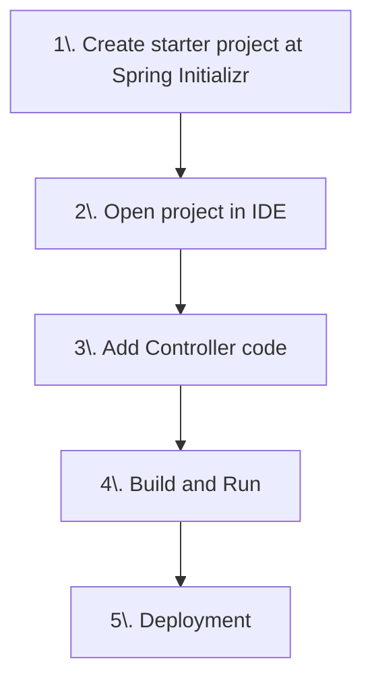

# Java Spring Framework

With Spring Boot, Spring Data JPA, Hibernate and Spring Security

Manpreet Rai (Course by Chad Darby)

Prerequisites
- Java Programming Language
- Java Development Kit (JDK) 17 or up
- IDE (Eclipse, Netbeans or IntelliJ IDE)

Spring framework is highly configurable but it is tedious to manage such project with so many dependencies. 

Solution: **Spring Boot**

#### Spring Boot

It is an opinionated framework management solution by spring team, which allows minimum headache of managing dependencies manually. 

Spring boot offers following advantages:
- Easier to get started with Spring
- Minimize manual configuration
  - Performs auto-config based on properties and JAR classpath
- Help resolve dependency issues using Maven/Gradle
- Provides multiple embedded servers:
  - Like Tomcat, Jetty, Undertow etc

Spring boot is not a different framework from Spring. It is a way of managing and creating the Spring apps an easy way. Behind the scenes, Spring Boot uses Spring.

#### Spring Initializr

Spring boot team provides an online tool for creating base project with facility to add dependencies and customize it on the same page. You can visit https://start.spring.io to use this tool to customize the project to your needs and download the starter project.

## Spring Boot Up and Running

Let's create a basic spring boot project where we create a controller and see Spring in action. Project overflow is shown as:

#### 1. Configure Starter Project
Visit the https://start.spring.io website and choose the following configuration for our starter project:

- Project - Maven
- Language - Java
- Spring Boot - 3.4.4 (Choose release verison)
- Project Metadata
  - Group - com.example (or choose as your needs)
  - Artifact - demo
  - Name - demo
  - Description - Demo project for Spring Boor
  - Package name - com.example.demo
  - Packaging - **Jar**
  - Java - **24** (Choose latest)

Now on right side, you can add dependencies. Choose the following:
- Spring Web
- Spring Boot Dev Tools (Optional - For auto building project)

Once you are happy with configuration, just **Generate and Download** project.

## Open project in IDE
We are using "IntelliJ IDEA Ultimate" here, you can choose any of these:
- Eclipse
- Netbeans
- IntelliJ IDEA
- VSCode

Spring team also provide helpful IDE Plugins and tools as "Spring Tool Suite" package. You can use these to help you with Spring.

Once you download your project **zip** file, just extract it somewhere on your system path and open it up in your IDE.

