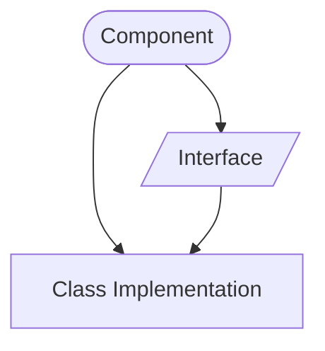
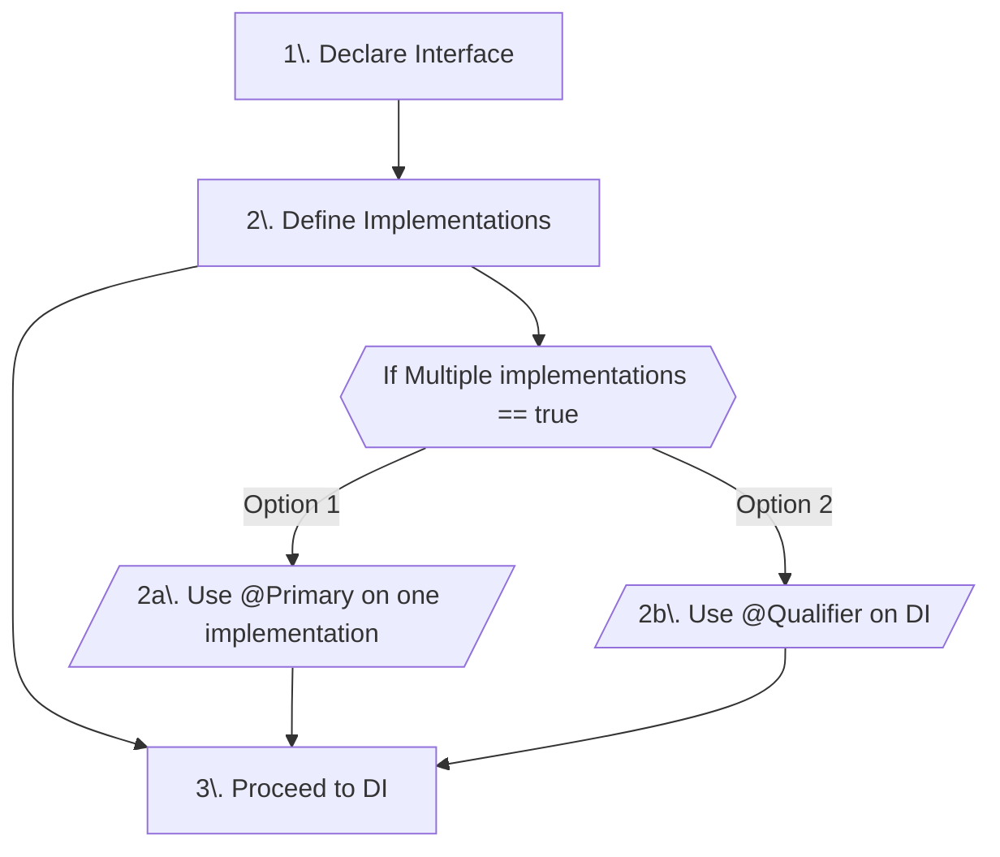
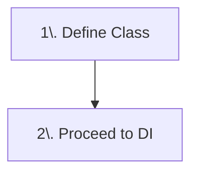
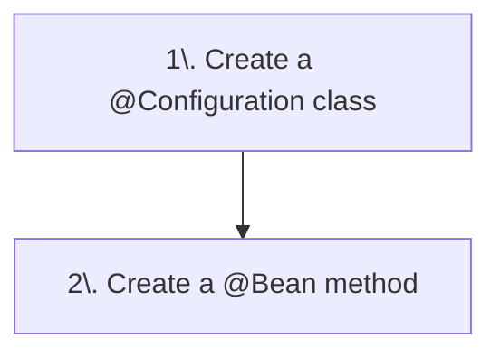
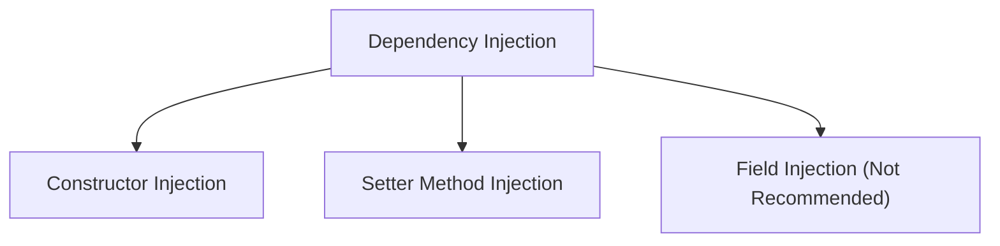
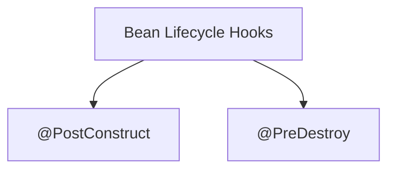

# Spring IoC and DI

Imaging you want to buy a car. There are two options for this:
- Buy all the components, build a car from scratch.
- OR, go to a dealership service and ask for a car, which in turn they will give you if they have at the moment or ask the car factory to build one and send to you.

Most people would with second approach as it is easy. Here you are delegating the tedious task of car creation and management on someone else, well to be explicit, you are delegating it to a service and which in turn acquiring it from a factory. This whole explains the principle of Inversion of Control and Dependency Injection.

Using ths above analogy, Spring boot provides two main benefits:
- Inversion of Control (IoC)
  - The process of outsourcing the construction and management of objects
- Dependency Injection (DI)
  - Fetching the already built objects to fulfill your needs

There are different number of ways you can create such objects and use them under the umbrella of IoC and DI. The easiest of them is creating a component, which is explained next.

# 1. Components
Spring components are just regular classes that contains `@Component` annotation (and some other annotations) are handled by Spring framework. By using this annotation, some special treatment is given to these by Spring IoC. Components are a type of Spring Beans.

A component is automatically scanned by Spring IoC container if it lies in same or sub-packages of application context. The component is then available for injection by IoC at runtime.

In case the components lies in other packages, you need to tell Spring where to scan its components. That can be easily done by overloading the `@SpringBootApplication` annotation in your main application source file with comma delimited list of package names like this

```java
@SpringBootApplication( 
    scanBasePackages = {
        "com.aryxo.crud.api", // you need to explicitly declare base package
        "org.other.package"   // other packages
    })
```

In order to declare a dependency, you need a Spring `Component` or other special types like `Bean`, `Repository`, `Controller` etc. Dependency means your app can depend on them for certain tasks or data.

## 1.1 Declaring @Component dependency
A component can be created in two ways. If you need a common functionality and there are multiple ways you can achieve it, then you need to have an interface that can declare the standard functionality, which can then be implemented in multiple ways. 

The second type involves a single class which you are sure is necessary and sufficient and there are no other implementations required.



#### 1.1.1 Interface Approach
Step by step overview of this approach is shown here



Starting with first approach, create an `Interface` with all the required methods. There is no annotation needed here.
```java
package com.aryxo.api;

import ...

public interface Coach {
    String getDailyWorkout();
}
```

Now you need to implement this interface. Let's say there are two types of Coaches i.e., `CricketCoach` and `HockeyCoach`. Now you need to implement these Coaches.

`CricketCoach.java`
```java
package com.aryxo.api;

import ...

@Component        // here, specify this is a Spring component
public class CricketCoach implements Coach {

    @Override
    public String getDailyWorkout() {
        return "Practice fast bowling for 15 minutes";
    }
}
```

Now let's implement another class,

`HockeyCoach.java`
```java
package com.aryxo.api;

import ...

@Component        // here, specify this is a Spring component
public class HockeyCoach implements Coach {

    @Override
    public String getDailyWorkout() {
        return "Do a quick sprint for 10 minutes";
    }
}
```

Since there are multiple implementations for this Interface, this confuses IoC during dependency injection, as to which implementation's object it should inject? So, here we have two options

#### A. Resolving ambuigity for dependency injection
There are two approaches to resolve ambuigity. First uses `@Primary` annotation. 

You can mark one of the multiple implementations are `@Primay`. This tells IoC that it should prefer to include the object of marked class whenever there is a confusion because of multiple implementations.

For example, let's say we want to mark `HockeyCoach` as `@Primary`.

`HockeyCoach.java`
```java
package com.aryxo.api;

import ...

@Primary          // note the primary annotation
@Component        // here, specify this is a Spring component
public class HockeyCoach implements Coach {

    @Override
    public String getDailyWorkout() {
        return "Do a quick sprint for 10 minutes";
    }
}
```

NOTE: Only and only one implementation of a particular interface should be marked as @Parimary. Multiple `@Primary` annotations again causes confusion on what to use.

Second method of resolving ambiguity (and preferred) is to make use of `@Quilfier` annotation during the use of Interface reference variable i.e., when you specify to inject dependency, you mark it with `@Qualifier` annotation right there.

Let's say you are doing dependency injection in a method argument.
```java
... // some code

public String someMethod(@Qualifier("hockeyCoach") Coach coach) {

    ... // method body
}
... // other code
```

Note the use of `@Qualifier` annotation. The default value you give to it is "beanId". `BeanId` can be created by lowercasing first character of class name whose bean you want to inject, here `HockeyCoach` can be referred by its beanId as `hockeyCoach`. Spring IoC can then automatically injects the object of that implementation to resolve ambiguity.

#### B. @Primary vs. @Qualifier

There are some advantages of using `@Qualifier` over `@Primary`:
- First, `@Qualifier` annotation has higher preference than `@Primary`. As it explicitly tells IoC on what to inject.
- Sometimes we don't have access to source code of a class, so we cannot mark them `@Primary` but we can easily use `@Qualifier` as it is involved when object of that class is made. It has nothing to do with source code

When to use `@Primary`? Well you can use it in following scenarios:
- When you have access to source code, you can mark a class `@Primary`
- In case you forgot to use `@Qualifier` annotation, your program will still work if any implementation is using `@Primary`, as IoC can still look what to implement.
- When you have multiple implementations but you know you will need only one particular class for most of cases, its easy to mark it `@Primary` and forget about the rest and the need to use `@Qualifier` annotation.

NOTE: In case of single implementation, you need not to use any of `@Primary` or `@Qualifier` annotations. A single class can be easily deduced by IoC without the need of any of these annotations and can be scanned and injected automatically.

#### 1.1.2 Single Class Approach
The overview of this approach is shown below:


In contrast to Interface implementations, if there is only one class and it includes all the functionality, and there is no need to have interface for the same, then you can directly use it for injection. There is no need to use `@Primary` or `Qualifier` annotations. Also since there is no Interface involved, you can directy use the class name for dependency injection by IoC.

Let's see an example of a class called that returns some useful message.

```java
package org.aryxo.crud;

import ...

@Component        // note the use of annotation
public class Greeting {
    public String sayHello() {
        return "Hello, World!";
    }
}
... // other code

// inside some other class
@Autowired        // tells IoC to auto inject dependecies (greeting object)
public SomeConstructor(Greeting greeting) {
    ... // method body
}
```

#### 1.1.3 Other compatible annotations
There are some other annotations that can be used along `@Component` annotation. These are as follows:
- `@Primary` as seen above, this goes hand in hand with `@Component` annotation. It is used to mark a class as Primary to resolve the ambiguity during instance intialization.
- `@Lazy` is used to make the instantiation delayed. This helps optimization of code. Since all beans are initialized at startup wether they are used or not later. To prevent this behaviour you can mark a class `@Lazy`. This allows Spring to instantiate only when there is a reference made to the class. Although it is usually not required.
  NOTE: You can globally assign Lazy to whole project as well using properties.
- `@Scope(ConfigurableBeanFactory.SCOPE_XXX)` is used to limit the number of instances Spring can create and share. By default, Scope of the instance is `SINGLETON` which means only one object is instantiated during boot and it is shared whenever injection is needed anywhere, but you can configure your app to create more instances using other Scope policies. 
  These are SINGLETON, PROTOTYPE (creates new instance on each injection request), REQUEST, SESSION, APPLICATION, WEBSOCKET. Last four are used in web apps only.

If all of these annotations are used, the class definition could look like this
```java
package com.aryxo.api;

import ...

@Component        // here, specify this is a Spring component
@Primary          // to resolve ambiguity, use this class as resolver
@Lazy             // delayed instantiation (on demand)
@Scope(ConfigurableBeanFactory.SCOPE_PROTOTYPE) // instantiate on each request 
public class HockeyCoach implements Coach {

    @Override
    public String getDailyWorkout() {
        return "Do a quick sprint for 10 minutes";
    }
}
```

## 1.2 Declaring @Bean dependency
Sometimes there's a class or interface whose source code is not available. In those cases we cannot simply mark a class as `@Component`. And it cannot be injected by IoC as a dependency. To resolve these cases we can use `@Bean` annotation on a `@Configuration` to manually create a bean out of such classes. 

There is a difference between `@Component` and `@Bean`. While `@Component` annotation targets a **Class** Type but `@Bean` annotates a **Method** Type. 

In short, `@Bean` annotations allows a method to return an object that can be used in dependency injection by IoC while `@Component` annotations allow a class object to be treated as a bean automatically.

Process flow for declaring a `@Bean` is as shown below


Assume you have Let's create a `@Configuration` class if it does not exist. Well, its a regular Java class with `@Configuration` annotation. You need a configuration class to create new beans. The main application class that has `@SpringBootApplication` annotation can also be used to register new beans as this annotation is a composite of three annotations internally and `@Configuration` is one of them.
```java
package org.aryxo.crud;

import ...

@Configuration
public class MessageConfiguration {

    @Bean
    public Greeting greet() {    // assuming that Greeting class exists
        return new Greeting();
    }
}

// inside some other class
...
@Autowired
public SomeConstructor(Greeting theMessage) {
    ... // constructor body
}
...
```

Note that the DI is assigning the bean instance to `theMessage`, the instance variable has nothing to do with the name of bean method. Also, the "beanId" this bean produces here will be same as the method name which is "greet" in this case. You can modify the beanId by changing the name of the method. 

Why we need beanId here? Well, if we have more beans registered with same class, then without using beanId for `@Qualifier` we cannot resolve ambiguity. See the example below which modifies above code
```java
package org.aryxo.crud;

import ...

@Configuration
public class MessageConfiguration {

    @Bean
    public Greeting greet() {
        return new Greeting();
    }

    @Bean
    public Greeting greetNew() {
        return new Greeting();
    }
}

// inside some other configuration class
...
    @Bean
    public Greeting greetExternal() {
        return new Greeting();
    }
}
...

// inside some other class
...
@Autowired
public SomeConstructor(Greeting theMessage) {    // <-- problem here
    ... // constructor body
}
...
```

The DI fails here, as it can find at least three instances of `Greeting` class and it cannot choose whom to use. In such scenarios we can explicitly use the method names for resolving ambiguity as these method names are automatically treated as "beanIds".
```java
package org.aryxo.crud;

import ...

@Configuration
public class MessageConfiguration {

    @Bean
    public Greeting greet() {
        return new Greeting();
    }

    @Bean
    public Greeting greetNew() {
        return new Greeting();
    }
}

// inside some other configuration class
...
    @Bean
    public Greeting greetExternal() {
        return new Greeting();
    }
}
...

// inside some other class
...
@Autowired
public SomeConstructor(@Qualifier("greetNew") Greeting theMessage) {
    ... // constructor body
}
...
```

Other way of modifying the beanId is using the `@Bean` annotation itself. Look at the snippet below
```java
... 
@Bean("newBeanId")
// OR 
@Bean(name = "newBeanId")
...
```

Then alongside the method names, you can also use the identifier next to the @Bean annotation to refer to these beans as beanId. Let's look at the modified code below
```java
package org.aryxo.crud;

import ...

@Configuration
public class MessageConfiguration {

    @Bean("greetSimple")          // OR @Bean(name = "greetSimple")
    public Greeting greet() {
        return new Greeting();
    }

    @Bean("greetEasy")            // OR @Bean(name = "greetEasy")
    public Greeting greetNew() {
        return new Greeting();
    }
}

// inside some other configuration class
...
    @Bean("greetBeautiful")        // OR @Bean(name = "greetBeautiful")
    public Greeting greetExternal() {
        return new Greeting();
    }
}
...

// inside some other class
...
@Autowired
public SomeConstructor(@Qualifier("greetBeautiful") Greeting theMessage) {
    ... // constructor body
}
...
```

NOTE: Here all Greeting instances are exact;y same, so it will cause no difference. Also, all these will be treated as different beans as these are individual calls to make new instances. Scope has no effect on these. It would have been beneficial if these instances offer some data during creation like below
```java
...
return new Greeting(message);        // message can be configured
...
```

Here `message` variable can be changed by each bean during initialization. This could be useful to some extent.

# 2. Dependency Injection
You have seen that we successfully delegated our task of creating instances to Spring by using the `@Component` and `@Bean` (though we created manually in bean, but its okay). Now is the time to inject and use them.

## 2.1 @Autowired Annotation
`@Autowired` annotation is used to automatically assign the values to a field. It matches the return type of variable and available beans and decides automatically (after resolving ambiguity issues using @Primary/@Qualifier) what needs to be assigned.

`@Autowired` works on instance variable (fields/properties as they have setters), constructors and setter methods only. It cannot be used elsewhere in the code like in statements.

## 2.2 Types of Injections

There are three types of Dependency injections possible


Why do we need these? Can't we use objects directly? 

Well NO. We cannot use them directly, we need a reference to them first, and references are assigned only when something is executed, like a constructor is called, or setter method is called or even an instance variable (field) is declared. So these are the perfect places (hooks) to attach our injections.

Let's assume we are using the two classes `HockeyCoach` and `CricketCoach` as above, also we assume there is a bean declaration like above before we proceed next.

#### 2.2.1 Constructor Injection
This is recommended type of injection for required dependencies. We use constructor of a class to inject these dependencies. You have seen this in above examples. Let's see it again as below:
```java
package com.aryxo.crm;

public class Employee {
    ... // some variables

    @Autowired
    public Employee(EmployeeDAO employeeDAO)    // use @Qualifier if needed
    ...
}
```

#### 2.2.2 Setter Method Injection
This is recommended type of injection for optional dependencies. We use setter methods of a class to inject these dependencies. Let's see it in action as below:
```java
package com.aryxo.crm;

public class Employee {
    ... // some variables

    @Autowired
    public void setEmployeeSalary(EmployeeDAO employeeDAO)
    ...
}
```

#### 2.2.2 Field Injection (Not Recommended)
This is recommended type of injection for optional dependencies. It was used previously but posed problems during testing, so Spring team does not recommend it now. Let's see its usage as below:
```java
package com.aryxo.crm;

public class Employee {
    ... // some variables

    @Autowired
    private Stocks ownedStocks; 
    ...
}
```

# 3. Bean Lifecycle Methods/Hooks
Beans, also Components (as they are beans too) offer two methods/hooks to initialize and destroy data used by beans. These are as shown:


All you need to do is just annotate your method with the required annotation depending on your need. Method's name does not matter here but it is recommended that its name mention its intention. Let's look at these both
```java
... // some code

@Component
public class MyComponent {
    public MyComponent() {
        ... // constructor code
    }

    @PostConstruct
    public void initializeStuff() {
        // initialization stuff
    }

    @PreDestroy
    public void cleanupStuff() {
        // cleaning stuff
    }
}
```
